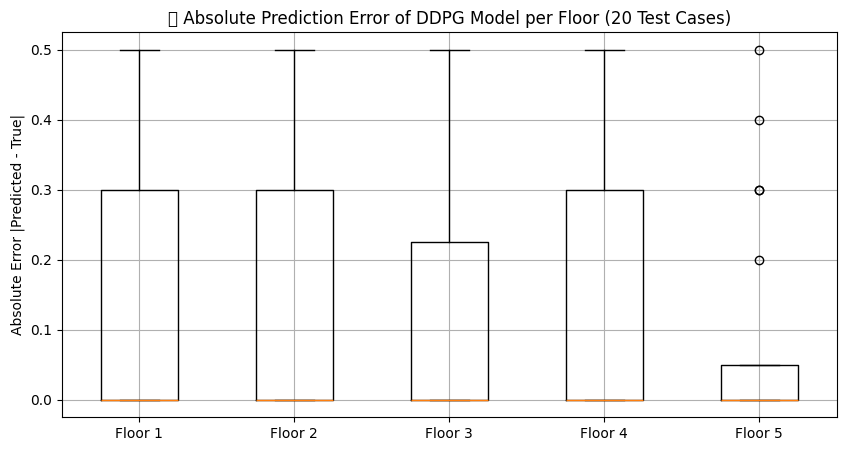
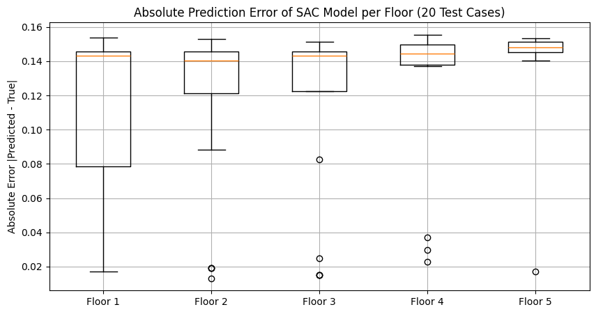
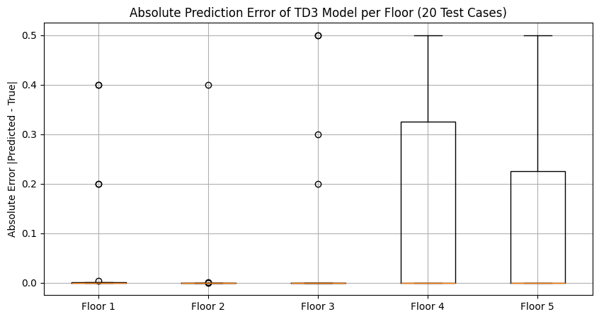
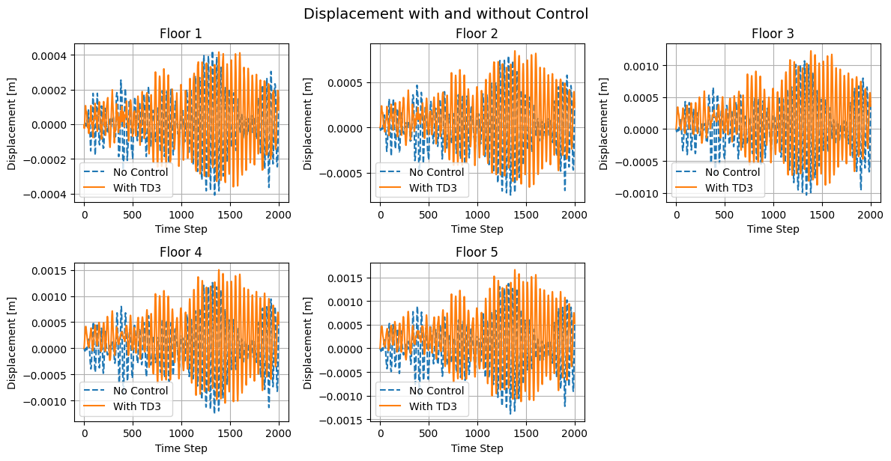
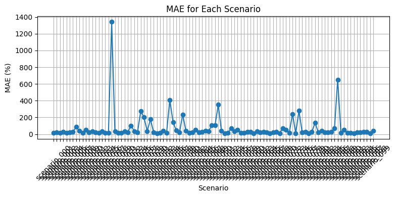

# Deep Reinforcement Learning for Structural Health Monitoring and Active Control

This repository presents a research-oriented implementation of Deep Reinforcement Learning (DRL) methods for structural health monitoring (SHM) and active vibration control of building structures.

The objective of this project is to investigate whether modern actor–critic reinforcement learning algorithms can reliably estimate structural damage and simultaneously provide effective vibration mitigation strategies within a physics-based simulation environment.

The work is based on a 5-degree-of-freedom (5‑DOF) shear building model, where structural damage is simulated through controlled stiffness reduction at different floors.

## Research Motivation

Structural health monitoring traditionally relies on sensitivity-based or model-updating techniques. While these approaches can be effective, they may struggle in nonlinear or high-uncertainty scenarios.

This research explores a data-driven alternative:

- Can reinforcement learning agents learn structural behavior directly from vibration data?
- Can a trained agent both detect damage and generate optimal control forces?

The goal is not only algorithm comparison, but also understanding the behavior and stability of different DRL methods in structural engineering applications.

## Implemented Algorithms

Three continuous-control actor–critic algorithms were implemented and evaluated:

- **DDPG (Deep Deterministic Policy Gradient)**
- **SAC (Soft Actor-Critic)**
- **TD3 (Twin Delayed Deep Deterministic Policy Gradient)**

Each agent was trained in a custom environment that models structural dynamics and stiffness degradation scenarios.

## Damage Detection Results

The agents were trained to estimate floor-wise stiffness reduction factors from vibration response data.

Training performance is illustrated below:

| DDPG | SAC | TD3 |
|------|-----|-----|
|  |  |  |

From the observed training behavior:

- SAC and TD3 demonstrate more stable convergence.
- DDPG shows higher variance in prediction performance.
- TD3 provides a strong balance between stability and accuracy.

## Active Vibration Control

A TD3-based controller was trained to minimize structural displacement under dynamic excitation.

The following figure compares structural response with and without control:

The controlled case shows noticeable reduction in peak displacement and faster vibration decay, demonstrating the feasibility of reinforcement learning for real-time structural control.

## Classical Baseline Comparison

For benchmarking purposes, a classical sensitivity-based method (NExT-PCA framework) was implemented.

While the classical approach performs adequately in structured scenarios, the DRL-based framework offers improved adaptability in more complex dynamic conditions.

## Dataset

The dataset consists of 100 simulated structural scenarios generated from the 5‑DOF building model.

Each scenario includes:

- Time-history vibration response data
- Corresponding floor-wise stiffness reduction factors

The dataset is provided in:
